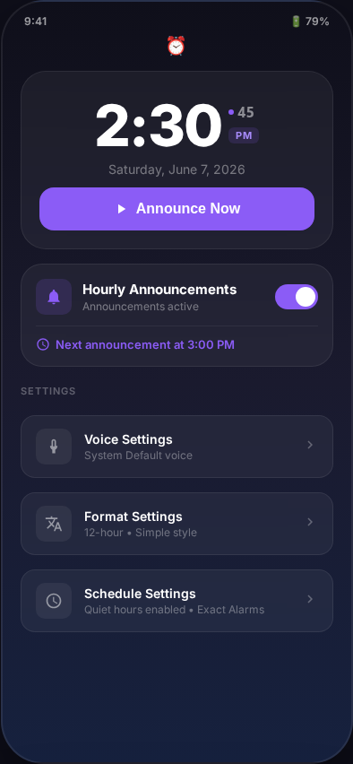
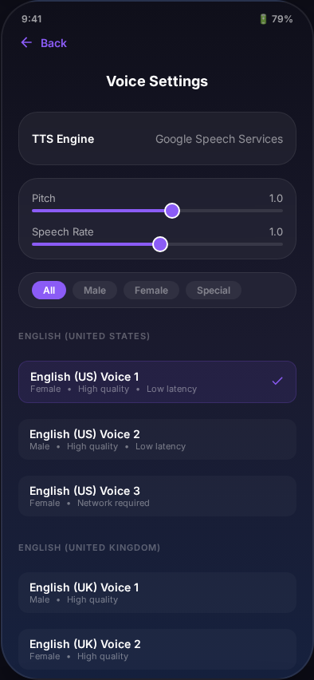
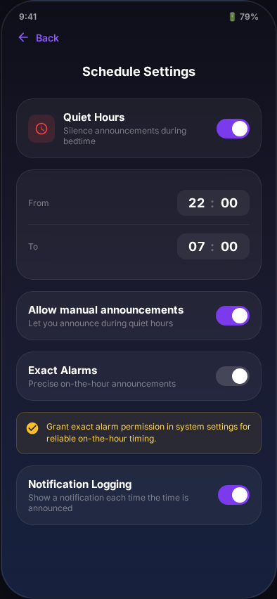

<picture>
  <source media="(prefers-color-scheme: dark)" srcset="docs/screenshots/home.png">
  <source media="(prefers-color-scheme: light)" srcset="docs/screenshots/home.png">
  
</picture>

<br>

<div align="center">

# ⏰ Hourly Voice Clock

**A beautiful, resilient Android app that speaks the time — on the hour, on demand, every time.**

[](https://developer.android.com/about/versions/oreo)
[](https://kotlinlang.org)
[](https://developer.android.com/jetpack/compose)
[](https://m3.material.io)
[](LICENSE)
[](https://github.com/iggut/hourly-voice-clock/pulls)

</div>

---

## 📱 Screenshots

<div align="center">

| Home Screen | Voice Settings | Schedule Settings |
|:---:|:---:|:---:|
|  |  |  |

</div>

---

## ✨ Features

<table>
<tr>
<td width="50%">

### 🗣️ Announcement Engine
- **Big time display** on the home screen with live seconds
- **Manual announcement** with a single tap — "Announce Now"
- **Hourly announcements** at the top of the hour via `AlarmManager`
- **Chime + vibrate** options before speaking
- **Notification logging** for announcement history

### 🎙️ Voice & Speech
- **Voice selection** grouped by locale/accent with quality/latency info
- **Pitch and speech rate** sliders with live preview
- **Special voice presets**: Robot, Narrator, Chipmunk, Paris Café, Professor, and more
- **eSpeak NG** engine support with fun voice variants
- **Multiple TTS engine** switching (Google, eSpeak, RHVoice)

</td>
<td width="50%">

### 🎚️ Format & Style
- **Phrase styles**: Simple, Detailed, Friendly, Custom
- **12-hour and 24-hour** time formats
- **Custom prefix/suffix** for your own phrasing
- **Greetings** by time of day (morning/afternoon/evening)
- **Date inclusion** in on-demand announcements

### 🛌 Scheduling
- **Quiet hours** with midnight-crossing support (e.g. 22:00–07:00)
- **Manual override** during quiet hours
- **Exact alarm permission** handling with graceful fallback
- **Resilient scheduling** across reboots, timezone changes, and app updates
- **Battery optimization** detection per manufacturer (Samsung, Xiaomi, Huawei, Oppo, Vivo)

### 🔄 In-App Updates
- **Automatic update check** against GitHub releases
- **In-app download** with progress tracking
- **Signature verification** before installation
- **One-tap install** from within the app

</td>
</tr>
</table>

---

## 🏗️ Architecture

The app follows a clean **package-by-feature** structure with a centralized dependency container (`AppDependencies`) and a testable seam at every boundary.

```text
com.hourlyvoiceclock/
│
├── di/                     # Dependency injection (composition root)
│   ├── AppDependencies.kt  # Lazy singleton container
│   └── DependenciesProvider.kt
│
├── announcer/              # Announcement pipeline
│   ├── TimeAnnouncer.kt    # Orchestrator: quiet hours, chime, TTS, focus
│   ├── AnnouncementFormatter.kt  # Pure text formatting
│   └── QuietHoursPolicy.kt       # Pure quiet-hours logic
│
├── scheduler/              # Android AlarmManager scheduling
│   ├── AnnouncementScheduler.kt
│   ├── AlarmPermissionChecker.kt
│   └── RescheduleAlarms.kt  # Shared receiver logic
│
├── receiver/               # BroadcastReceivers
│   ├── AlarmReceiver.kt     # Fires hourly announcements
│   ├── BootReceiver.kt      # Reschedules after boot
│   └── TimeChangedReceiver.kt  # Handles timezone/DST changes
│
├── tts/                    # Text-to-Speech engine layer
│   ├── TtsEngine (interface) + AndroidTtsEngine (impl)
│   └── VoiceInfo.kt
│
├── data/                   # Settings & update management
│   ├── AppSettings.kt       # 22-field settings data class
│   ├── SettingsRepository.kt
│   ├── SettingsMigration.kt
│   ├── UpdateChecker.kt     # GitHub releases API
│   ├── UpdateDownloader.kt  # APK download with progress
│   └── SignatureVerifier.kt
│
├── ui/                     # Jetpack Compose screens
│   ├── home/               # Main clock + dashboard
│   ├── voicesettings/      # Voice browser + presets
│   ├── formatsettings/     # Phrase, format, chime options
│   ├── schedulesettings/   # Quiet hours, alarms, battery
│   ├── navigation/         # NavHost + routes
│   └── theme/              # Material 3 theming + glass-morphism
│
└── util/                   # Extensions
```

### Design Principles

| Principle | Applied here |
|:---|---|
| **Injection seams** | All ViewModels and BroadcastReceivers access dependencies through `DependenciesProvider`, not inline `new`. Enables full unit testing. |
| **Depth over breadth** | Small, focused interfaces. `TtsEngine` interface replaced a 15-method pass-through repository. |
| **Deletion test** | Every module should concentrate complexity, not just move it. Verified by deleting `TtsVoiceRepository` — the behaviour was absorbed into the existing engine. |
| **Pure functions extracted** | `AnnouncementFormatter`, `QuietHoursPolicy`, and version comparison are pure functions separated from Android framework code. |
| **Single responsibility** | `TimeAnnouncer` orchestrates; `AlarmPermissionChecker` handles permissions; `UpdateChecker` handles API queries. |

---

## 🛠 Tech Stack

| Category | Technology |
|:---|---|
| **Language** | Kotlin 2.0 |
| **UI Framework** | Jetpack Compose + Material 3 (dynamic theming, glass-morphism) |
| **Navigation** | Compose Navigation (4-route NavHost) |
| **Architecture** | ViewModel + StateFlow + Coroutines |
| **Persistence** | DataStore (Preferences) with schema migration |
| **Scheduling** | AlarmManager (exact + inexact fallback) |
| **TTS** | Android TextToSpeech API with multi-engine support |
| **Network** | OkHttp for GitHub release API + APK download |
| **Testing** | JUnit, Robolectric, Mockito, Compose UI tests |

---

## 🚀 Getting Started

### Prerequisites
- Android Studio Giraffe (2022.3.1+) or newer
- Android SDK 34+
- A device or emulator running Android 8.0 (API 26) or higher

### Build & Run

```bash
# Clone the repository
git clone https://github.com/iggut/hourly-voice-clock.git
cd hourly-voice-clock

# Build debug APK
./gradlew assembleDebug

# Run unit tests
./gradlew test

# Run instrumented tests (requires connected device/emulator)
./gradlew connectedAndroidTest

# Install on emulator
adb install -r app/build/outputs/apk/debug/app-debug.apk
```

---

## 📋 Permissions

| Permission | Purpose | Required |
|:---|---|:---:|
| `POST_NOTIFICATIONS` | Notification logging (Android 13+) | Optional |
| `SCHEDULE_EXACT_ALARM` | Precise top-of-hour timing | Optional (falls back to inexact) |
| `RECEIVE_BOOT_COMPLETED` | Reschedule alarms after reboot | Yes |
| `VIBRATE` | Pre-announcement vibration | Optional |
| `INTERNET` | GitHub release API for updates | Optional |

---

## 📱 Android Version Compatibility

- **Minimum**: Android 8.0 (API 26)
- **Target**: Android 14 (API 34)
- **Exact alarms**: Android 12+ (API 31) requires user grant via **Settings → Apps → Hourly Voice Clock → Alarms & reminders**
- **OEM-specific**: OneUI, MIUI, EMUI, ColorOS, and Funtouch each have battery/background restrictions — the app detects and helps the user navigate them

---

## 🧪 Testing

```bash
# Unit tests (pure Kotlin + Robolectric)
./gradlew test

# Instrumented tests (Compose UI tests)
./gradlew connectedAndroidTest

# Build verification (test + assemble)
./gradlew test assemble
```

The app currently has **60+ unit tests** covering:
- `AnnouncementFormatter` — all phrase styles, time formats, date inclusion
- `QuietHoursPolicy` — midnight crossing, edge cases, manual override
- `AlarmPermissionChecker` — API-level branching, manufacturer detection
- `SettingsRepository` helpers — version comparison, time parsing
- `SettingsMigration` — schema upgrades, data sanitization

---

## 🔬 Release QA Matrix

| Test Scenario | Pixel | Samsung | Xiaomi | Expected Outcome |
|:---|---:|:---:|:---:|:---|
| Exact Alarm Toggling | ✓ | ✓ | ✓ | Persisted to DataStore; triggers system permission flow |
| Notification Logging | ✓ | ✓ | ✓ | Runtime permission prompt; logs to notification drawer |
| Battery Optimization | ✓ | ✓ | ✓ | Detects & links to system battery screen |
| Boot Recovery | ✓ | ✓ | ✓ | Re-arms hourly schedule automatically after restart |
| Timezone Change | ✓ | ✓ | ✓ | Reschedules from the new timezone's next hour |
| Quiet Hours | ✓ | ✓ | ✓ | Midnight-crossing range; manual override respected |

---

## 🔄 CI/CD

Release builds are automated via **GitHub Actions**:

- **Trigger**: Pushing a version tag (e.g. `v0.1`)
- **Pipeline**: Test verification → Release compilation → Artifact signing
- **Outputs**: `hourly-voice-clock-v[version]-release.apk` + SHA256 checksum

---

## 🔒 Privacy

- **No personal data collected.** Period.
- The only network requests are:
  1. GitHub releases API (if auto-update is enabled)
  2. Network-required TTS voices (opt-in, indicated in voice list)
- No analytics, no tracking, no ads.

---

## 📄 License

Distributed under the MIT License. See `LICENSE` for more information.

---

<div align="center">
  <sub>Built with 🎯 by <a href="https://github.com/iggut">iggut</a></sub>
</div>
